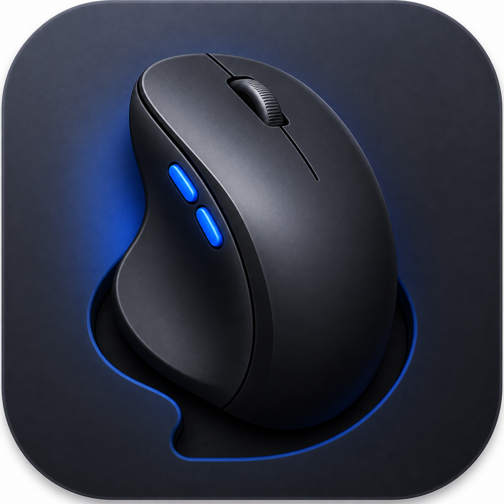

# NativeLogi

NativeLogi is an independent, open-source macOS utility for Logitech mice.
It is built for people who want native device control without running the heavy
Logi Options+ background stack.



## Why

Logi Options+ can intercept Logitech mouse buttons and turn physical side
buttons into app-level back/forward actions. That is fine in browsers, but it
breaks games and tools that expect real Mouse4 / Mouse5 input.

NativeLogi starts by restoring native side-button behavior for MX Master-style
mice, then grows into a lightweight local control panel for DPI, SmartShift,
button bindings, and per-app profiles.

## Current Highlights

- Native Mouse4 / Mouse5 pass-through for Logitech side buttons on macOS.
- DPI controls over HID++.
- SmartShift / wheel controls where supported by the device.
- Local configuration, no account requirement, no telemetry.
- Works with Bluetooth-direct devices and supported Logi Bolt paths.

## Project Status

NativeLogi is an early fork based on OpenLogi. The first public goal is a stable
macOS build for Logitech MX Master users who want native side buttons and basic
device controls without Logi Options+.

The codebase still uses OpenLogi crate names internally. The public product
name, app packaging, icon, and documentation are being migrated gradually so the
working HID++ implementation stays stable.

## Build From Source

There is no signed public release yet.

For now, build from source:

```sh
cargo build -p openlogi-agent -p openlogi-gui --release
```

The current development binaries are:

```text
target/release/openlogi-gui
target/release/openlogi-agent
```

The internal crate and binary names still use `openlogi` while the public app
brand is being migrated to NativeLogi.

## macOS Permissions

NativeLogi needs two macOS permissions:

- **Accessibility**: required for the mouse event tap and button remapping.
- **Input Monitoring**: required to open HID devices, especially
  Bluetooth-direct Logitech mice.

If the app is rebuilt or re-signed locally, macOS may treat it as a new app and
require the permissions to be granted again.

## Roadmap

- Package a NativeLogi-branded `.app`.
- Replace the remaining OpenLogi app names and bundle identifiers.
- Add a reproducible release workflow.
- Add a first public DMG / ZIP release.
- Improve game-profile ergonomics for native side-button use.

## Credits

NativeLogi is based on [OpenLogi](https://github.com/AprilNEA/OpenLogi), which
is dual-licensed under MIT or Apache-2.0.

Thanks to the OpenLogi project and its upstream dependencies, including HID++
work inspired by projects such as Solaar and Mouser.

## Trademark Notice

NativeLogi is an independent open-source project and is not affiliated with,
endorsed by, or sponsored by Logitech.

Logitech, Logi, Logi Options+, MX Master, and related marks are trademarks or
registered trademarks of Logitech Europe S.A. and/or its affiliates.

## License

The source code remains dual-licensed under either:

- Apache License, Version 2.0 ([LICENSE-APACHE](LICENSE-APACHE))
- MIT License ([LICENSE-MIT](LICENSE-MIT))

The NativeLogi brand assets under `assets/brand/` are separate project branding
assets and are not Logitech brand assets.
